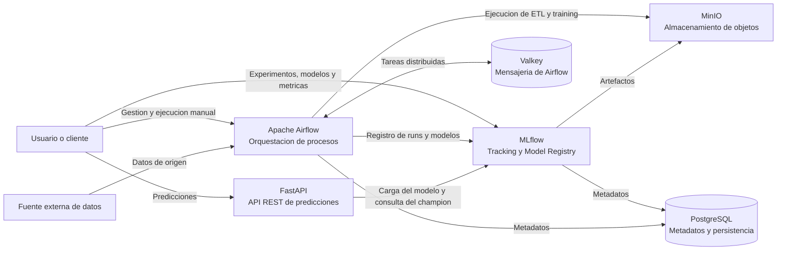
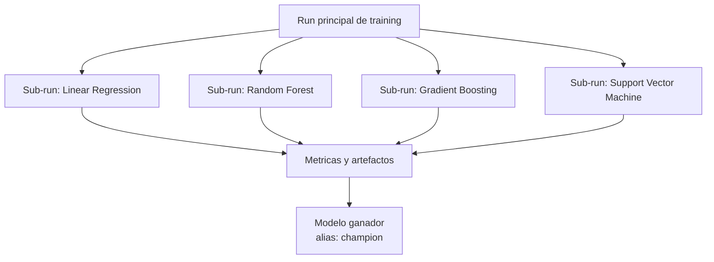
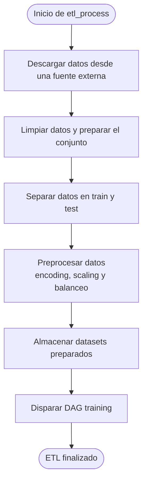
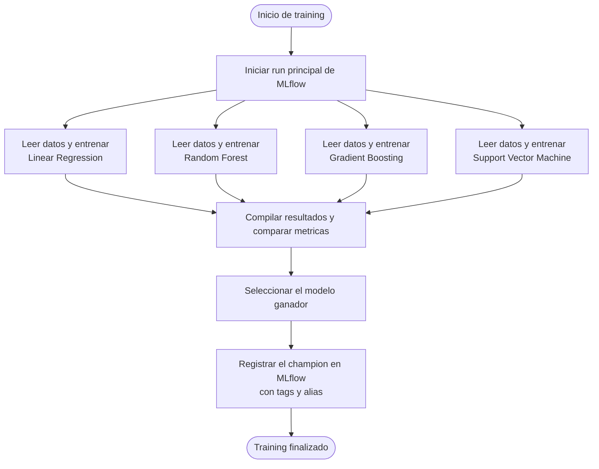
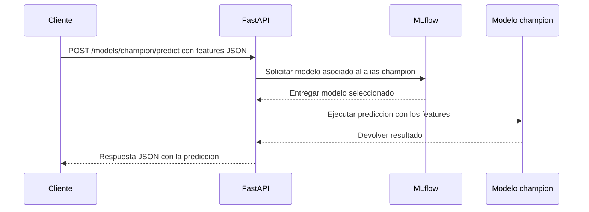

# Plataforma MLOps

## Descripcion general

La plataforma implementa un flujo completo para preparar datos, entrenar y
registrar modelos de machine learning, y exponer el modelo seleccionado para
realizar predicciones. El sistema esta compuesto por una API REST desarrollada
con FastAPI, MLflow como plataforma de experimentacion y gestion del ciclo de
vida de modelos, y Apache Airflow como orquestador de los procesos de datos y
entrenamiento.

Los servicios se ejecutan como una arquitectura distribuida. MinIO proporciona
el almacenamiento de objetos para datos y artefactos, PostgreSQL almacena la
informacion persistente de MLflow y Airflow, y Valkey funciona como soporte de
mensajeria para la ejecucion distribuida de Airflow.

## Arquitectura

El siguiente diagrama muestra los componentes principales y sus relaciones,
sin detallar la implementacion interna de cada servicio.



### Interfaces de usuario

- **FastAPI** expone una API REST y su documentacion interactiva mediante
  Swagger UI.
- **MLflow** proporciona una interfaz web para consultar experimentos, runs,
  metricas, artefactos y versiones registradas.
- **Airflow** proporciona una interfaz web para observar DAGs, revisar sus
  ejecuciones, consultar logs y lanzar procesos manualmente.
- **MinIO** proporciona una interfaz web para inspeccionar los buckets de
  datos y artefactos.

## FastAPI

FastAPI es la puerta de entrada para consumir los modelos registrados en
MLflow. La API recibe un conjunto de features en formato JSON, resuelve el
modelo solicitado y devuelve la prediccion generada.

La API publica los siguientes endpoints:

| Metodo | Endpoint | Descripcion |
| --- | --- | --- |
| `GET` | `/models` | Retorna el listado de modelos disponibles. |
| `POST` | `/models/champion/predict` | Predice utilizando el modelo que actualmente tiene el alias `champion`. |
| `POST` | `/models/{id}/predict` | Predice utilizando el modelo identificado por `{id}` en MLflow. |

El identificador `champion` es un caso especial. En cada solicitud, la API
consulta el modelo que ocupa ese alias en MLflow, por lo que la prediccion usa
el modelo con mejor resultado seleccionado por el proceso de entrenamiento.
El endpoint parametrizado permite solicitar de forma explicita otro modelo
registrado.

Para consultar el listado de modelos disponibles se utiliza el endpoint `GET`:

```bash
curl -X GET "http://localhost:8800/models"
```

La estructura exacta del JSON depende de los features utilizados por el modelo
activo. Por ejemplo, una solicitud conceptual para el modelo champion es:

```bash
curl -X POST "http://localhost:8800/models/champion/predict" \
  -H "Content-Type: application/json" \
  -d '{
    "features": {
      "feature_1": 10.5,
      "feature_2": 3,
      "feature_3": "valor"
    }
  }'
```

Para consultar un modelo especifico se utiliza su identificador en la ruta:

```bash
curl -X POST "http://localhost:8800/models/modelo-ejemplo/predict" \
  -H "Content-Type: application/json" \
  -d '{
    "features": {
      "feature_1": 10.5,
      "feature_2": 3,
      "feature_3": "valor"
    }
  }'
```

La documentacion interactiva de FastAPI esta disponible en
`http://localhost:8800/docs` y permite inspeccionar los contratos de la API y
probar las solicitudes desde el navegador.

## MLflow

MLflow centraliza el seguimiento de experimentos y la gestion de los modelos.
Sus responsabilidades dentro del sistema son:

- Registrar los entrenamientos, parametros, metricas y artefactos producidos.
- Organizar cada ejecucion dentro de un experimento.
- Mantener el registro de los modelos y sus versiones.
- Identificar el modelo seleccionado como `champion` mediante alias y tags.
- Proporcionar a FastAPI el modelo que debe utilizar para generar
  predicciones.

Los artefactos de los experimentos y modelos se almacenan en MinIO, mientras
que la informacion de seguimiento y registro se persiste en PostgreSQL. MLflow
tambien ofrece una interfaz web para explorar la evolucion de las metricas,
comparar ejecuciones y consultar el modelo champion.

### Estructura de los runs de entrenamiento

Cada ejecucion del DAG `training` se registra como un run principal de MLflow.
Dentro de ese run se crea un sub-run para cada familia de modelos evaluada.
Esta estructura permite comparar modelos y sus busquedas de hiperparametros
manteniendo todo el proceso de entrenamiento agrupado.



## Airflow y orquestacion de procesos

Apache Airflow coordina las tareas de preparacion de datos y entrenamiento
mediante dos DAGs. Cada DAG puede observarse y ejecutarse desde la interfaz
web de Airflow.

El DAG `etl_process` se ejecuta automaticamente cada 15 dias, de acuerdo con
la frecuencia de actualizacion de la fuente de datos. El DAG `training` se
dispara automaticamente cuando finaliza correctamente `etl_process`. Ambos
DAGs tambien pueden ejecutarse manualmente a pedido de un usuario.
El DAG `training` no tiene una frecuencia propia: se ejecuta mediante el
disparo del DAG de ETL o manualmente.

### DAG `etl_process`

Este DAG transforma los datos de origen en un conjunto preparado para el
entrenamiento y la evaluacion. El resultado se almacena en MinIO para que
`training` pueda consumirlo de forma reproducible.



Las etapas del DAG son:

1. **Descarga:** obtiene la version actual de los datos desde la fuente
   externa.
2. **Limpieza:** corrige inconsistencias y prepara los registros para las
   siguientes etapas.
3. **Split:** divide el conjunto en datos de entrenamiento y de prueba.
4. **Preprocesamiento:** aplica encoding, escalado y balanceo de acuerdo con
   las necesidades del problema.
5. **Almacenamiento:** guarda los conjuntos resultantes para su consumo por el
   DAG de entrenamiento.
6. **Disparo:** ejecuta el DAG `training` cuando el almacenamiento finaliza
   correctamente. Esta etapa utiliza `TriggerDagRunOperator`.

### DAG `training`

Este DAG toma los datos preparados por `etl_process`, inicia un run principal
de MLflow y ejecuta en paralelo cuatro tareas de entrenamiento. Cada tarea
representa una familia de modelos, lee conceptualmente los datos de train y
test, y se registra como un sub-run del run principal.



El entrenamiento de cada familia de modelos se registra dentro de su propio
sub-run de MLflow. Las cuatro tareas se ejecutan en paralelo y sus resultados
convergen en una tarea de compilacion. Esta tarea selecciona el mejor resultado
y lo compara con las metricas del modelo que actualmente tiene el alias
`champion`. Si el nuevo resultado es superior, el DAG registra la nueva version
en MLflow, agrega sus tags descriptivos y actualiza el alias `champion`.

La implementacion actual es un esqueleto demostrativo: las tareas solo esperan
con `sleep()` y retornan valores ficticios para mantener la cadena de
dependencias. La lectura de datos, el entrenamiento, los sub-runs y el registro
real en MLflow quedan indicados mediante comentarios para una implementacion
posterior.

## Flujo de prediccion

El flujo de inferencia separa al consumidor de los detalles internos de
entrenamiento y registro:



De esta forma, el cliente siempre utiliza un contrato REST estable, mientras
que la version concreta del modelo puede cambiar cuando una nueva ejecucion de
`training` actualiza el alias `champion`.

## Persistencia y almacenamiento

- **MinIO:** conserva los datasets preparados, los artefactos de MLflow y los
  archivos asociados a los modelos.
- **PostgreSQL:** conserva los metadatos de experimentos y modelos de MLflow,
  junto con la informacion persistente de Airflow.
- **Valkey:** soporta la comunicacion necesaria para distribuir las tareas de
  Airflow entre sus componentes de ejecucion.

Estos servicios complementan a FastAPI, MLflow y Airflow, pero no exponen el
contrato funcional principal del sistema. La interaccion de usuarios se realiza
principalmente mediante la API REST y las interfaces web de los servicios.
